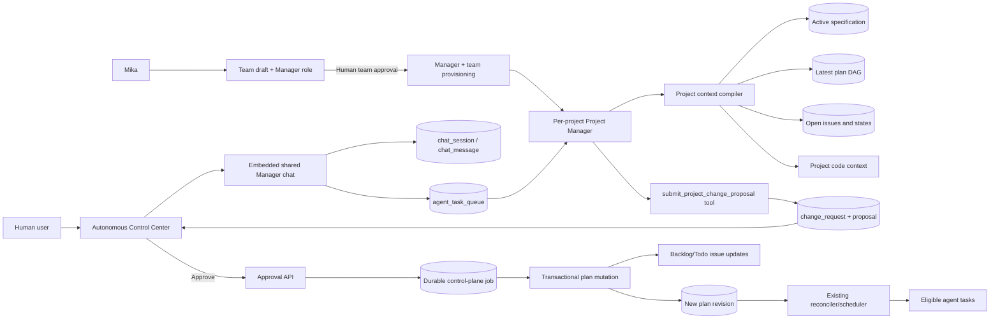

# Autonomous Project Manager ve Gömülü Proje Chat'i

**Durum:** Onaylı uygulama planı  
**Tarih:** 2026-09-09  
**Kapsam:** Autonomous Control Center içinde proje lideriyle konuşma, değişiklik önerisi, insan onayı ve çalışan workflow'u kesmeden plan/issue güncelleme

## 1. Karar özeti

Her proje için team approval sonrasında kalıcı bir **Project Manager** agent'ı bulunacak. Bu agent, team draft içindeki mevcut `product_manager` rolünün proje kapsamındaki karşılığıdır; yeni paralel planner/agent sistemi oluşturulmayacaktır. Autonomous ekranı Manager ile konuşmak için gömülü, proje ortaklı bir chat paneli sunacaktır. Mevcut `chat_session`, `chat_message`, `agent_task_queue` ve proje bağlamlı chat akışı tekrar kullanılacaktır.

Manager:

1. Kullanıcının talebini konuşma içinde netleştirecek.
2. Gerekliyse soru soracak; yeterli bilgi oluşmadan task üretmeyecek.
3. Aktif specification, son plan DAG'i, açık issue'lar ve proje kod bağlamını inceleyecek.
4. Eklenecek ve güncellenecek taskları yapılandırılmış bir proposal olarak gösterecek.
5. Kullanıcı açıkça onaylamadan planı veya issue'ları değiştirmeyecek.
6. Onaydan sonra değişikliği dayanıklı control-plane işi olarak uygulayacak; mevcut workflow kendiliğinden devam edecek.

Lifecycle:

1. Mika proje oluştururken team draft'ı ve `product_manager` rolünü hazırlar.
2. Human team approval gelmeden Manager agent'ı, Manager chat'i veya ilk task bootstrap'ı oluşturulmaz.
3. Team approval sonrasında Manager ve diğer agent'lar mevcut provisioning transaction'ı ile oluşturulur; Manager runtime/model/skills profilini seçilen team ayarlarından miras alır.
4. Provisioning tamamlanınca mevcut project-planning loop isteği Manager agent'a gönderilir. Manager ilk plan/DAG/task/assignment önerisini üretir; backend doğrular ve scheduler mevcut mekanizma ile devam eder.

En önemli güvenlik kuralı:

> `in_progress`/`running`/`verification` durumundaki task, plan node'u, atama ve çalışan agent hiçbir biçimde değiştirilmeyecek veya kesilmeyecek. Yalnız `backlog` ve `todo` karşılığı olan `pending`/`ready` işler yerinde güncellenebilir. Tamamlanmış işe gereken değişiklik yeni bir follow-up task olarak eklenir.

## 2. Hedefler

- Kullanıcının Autonomous ekranından ayrılmadan proje lideriyle doğal biçimde konuşabilmesi.
- Yeni özellik, bug, kapsam veya öncelik taleplerinin mevcut proje gerçekliğiyle karşılaştırılması.
- Task ekleme/güncelleme önerisinin insan tarafından anlaşılabilir bir diff olarak sunulması.
- Onayın atomik, idempotent ve yarış koşullarına dayanıklı uygulanması.
- Aktif agent tasklarının cancel/retry/restart edilmemesi.
- Yeni veya güncellenmiş hazır işlerin mevcut scheduler/reconciler tarafından otomatik çalıştırılması.
- Uygulama veya bildirim geçici olarak hata verse bile workflow'un kalıcı olarak tıkanmaması.

## 3. Kapsam dışı

- Ayrı bir mesajlaşma altyapısı veya ikinci task kuyruğu yazmak.
- Liderin onaysız olarak issue/plan değiştirmesi.
- Onay sırasında projeyi global olarak pause etmek veya workflow resetlemek.
- Çalışan agent'a yeni talimat enjekte etmek, agent'ı durdurmak veya taskını yeniden başlatmak.
- Tamamlanmış taskın geçmişini yeniden yazmak.
- İlk sürümde serbest biçimli agent metnini regex/JSON ayıklama ile güvenilir kabul etmek.
- Yeni bir workflow motoru, event bus veya harici bağımlılık eklemek.

## 4. Mevcut altyapı ve yeniden kullanım

Bu özellik için gerekli omurganın büyük bölümü zaten mevcut:

| İhtiyaç | Mevcut yapı | Kullanım kararı |
|---|---|---|
| Proje bağlı sohbet | `CreateChatSession`, `project_id`, `SendChatMessage`, `SendDirectChatMessage` | Aynı kalıcı mesaj ve task kuyruğu kullanılacak |
| Sohbet arayüzü | `packages/views/chat/components/chat-window.tsx` ve core chat hook'ları | Küçük, yeniden kullanılabilir message-list/composer parçaları ayrıştırılacak; tam sayfa bileşeni gömülmeyecek |
| Autonomous ekranı | `AutonomousControlCenter` ve 5 saniyelik snapshot yenilemesi | Lider paneli ve proposal durumu burada gösterilecek |
| Proje yöneticisi | Team provisioning içindeki `product_manager` agent'ı | UI'da Project Manager olarak gösterilecek; delivery node'larına atanmayarak sohbetin aktif işlerle yarışması önlenecek |
| Değişiklik yaşam döngüsü | `autonomous_project_change_request` ve event history | Konuşmadan çıkan önerinin kayıt/audit kaynağı olacak |
| Plan değişikliği | `ApplyPlanMutation`, `AnalyzeChangeImpact`, `autonomous_project_plan_mutation` | Operasyon modeli ve DAG doğrulaması tekrar kullanılacak |
| Dayanıklı arka plan işi | `enqueuePlanMutation`, control-plane lease/heartbeat/retry | Onay HTTP isteğinde inline apply yapılmayacak |
| Issue materialization ve dispatch | `ensureProjectNodeIssue`, `refreshReadyTx`, `processProjectSchedulingForProject` | Commit sonrası mevcut reconciler yeni işi başlatacak |
| Tamamlanmış planı açma | `ResumeCompletedPlanForDiscoveredWork` | Onay yeni iş eklediyse plan otomatik aktif hale getirilecek |

### 4.1 Düzeltilmesi gereken mevcut açık

`ApplyChangePlanMutation` şu anda yeni planı `PersistPlan` ile oluşturduktan sonra ayrı bir transaction içinde eski node state'lerini taşıyor ve change request'i `applied` yapıyor. Bu iki aşama arasında hata oluşursa yarım hazırlanmış yeni plan görülebilir. Ayrıca onay ile apply arasında bir `todo` task `in_progress` durumuna geçmiş olabilir.

Bu nedenle özellik yalnız UI/API bağlantısı olarak eklenmemeli. Önce plan apply yolu proje kilidi, base-revision karşılaştırması ve transaction içi son durum doğrulamasıyla güçlendirilmelidir.

## 5. Önerilen mimari



### 5.1 Manager ve Team Leader ayrımı

Project Manager müşteriyle konuşur, proje hedefi/kapsamı/öncelik/dependency ve backlog yönetimini yapar; kod yazmaz. Team Leader ise kendi squad'ının günlük execution koordinasyonunu ve somut agent atamasını yapar. Manager, Team Leader'ın yerine geçmez; Project Manager yalnızca proje seviyesinde görev ve atama önerir.

Manager bulunamazsa sohbet yeni ve ayrı bir agent üretmeye çalışmayacak. Team approval tamamlanmamışsa UI statik olarak team approval bekleme durumunu gösterir; runtime hazır değilse Manager runtime bekleme ve retry göstergesi gösterilir. Existing project'ler için idempotent backfill yalnız Manager agent/session yoksa çalışır; ilk bootstrap tasklarını yeniden üretmez.

## 6. Kullanıcı deneyimi

### 6.1 Yerleşim

`AutonomousControlCenter` içine **Project Manager** bölümü eklenir:

- Masaüstünde mevcut kontrol/diagnostic alanlarının altında iki kolonlu panel veya genişliği uygunsa sağ panel.
- Dar ekranda normal document flow içinde tek kolon.
- Başlıkta lider adı, runtime/queue durumu ve son activity.
- Sayfadan çıkmadan mesaj listesi, composer, attachment desteği ve queued/running göstergeleri mevcut chat primitive'lerinden gelir.
- Panel açılması LLM task'ı başlatmaz; statik karşılama ve Manager profili gösterilir. İlk kullanıcı mesajı durable chat task'ını başlatır.
- Panelin altında ya da son lider mesajına bağlı olarak **Proposed project changes** kartı gösterilir.

### 6.2 Konuşma akışı

1. Kullanıcı isteğini yazar.
2. Manager gerekli ayrıntıları sorar.
3. Yeterli bilgi oluştuğunda `Analyzing project…` durumu görünür.
4. Lider serbest metinle özet verir ve typed tool üzerinden proposal kaydeder.
5. UI aşağıdaki diff'i gösterir:
   - eklenecek tasklar,
   - güncellenecek `backlog`/`todo` tasklar,
   - değişmeden korunacak aktif/tamamlanmış tasklar,
   - bağımlılık değişiklikleri,
   - kabul kriterleri ve gerekçe,
   - çakışma veya riskler.
6. Yetkili kullanıcı `Approve`, `Request changes` veya `Reject` seçer.
7. `Approve` sonrasında panel `Applying…` olur; sohbet kilitlenmez fakat aynı proposal ikinci kez onaylanamaz.
8. Uygulama tamamlanınca yeni plan revision ve etkilenen issue bağlantıları gösterilir. Scheduler ayrıca butona gerek kalmadan devam eder.

### 6.3 Proposal state modeli

Mevcut state modeli korunur:

```text
received -> analyzing -> proposal_ready -> approval_required
approval_required -> approved -> applying -> applied
approval_required -> rejected
approved/applying -> failed (retry edilebilir teknik hata)
```

`Request changes` için yeni state eklemek yerine eski proposal `rejected` olarak audit edilir ve aynı chat/session referanslı yeni bir change request oluşturulur. Aynı yaklaşım stale proposal için kullanılır: eski kayıt `rejected` + `superseded_reason`, yeniden analiz sonucu yeni request. Böylece mevcut DB state constraint genişletilmez.

## 7. Lider oturumu ve kimlik modeli

### 7.1 Oturum kapsamı

- Her `(workspace, project)` için bir aktif, ortak Project Manager chat oturumu.
- Project üyeleri transcript'i okuyabilir; proje yazma yetkisi olan üyeler mesaj gönderebilir. Approval yalnız workspace owner/admin içindir.
- Session `product_manager` agent'ına ve `project_id`'ye bağlıdır.
- Manager agent değişirse session agent/runtime bağlantısı kontrollü güncellenir; eski transcript korunur.

### 7.2 En küçük şema ilavesi

Başlık veya `is_agent_intro` gibi dolaylı alanlara güvenilmemeli. `chat_session` üzerine açık bir discriminator eklenir:

```sql
session_kind TEXT NOT NULL DEFAULT 'standard'
CHECK (session_kind IN ('standard', 'autonomous_project_leader'))
```

Get-or-create yarışını veritabanında kapatmak için ayrı, tek statement migration:

```sql
CREATE UNIQUE INDEX CONCURRENTLY uq_chat_session_project_leader
ON chat_session (workspace_id, project_id, session_kind)
WHERE session_kind = 'autonomous_project_leader' AND status = 'active';
```

Migration kuralları:

- Yeni foreign key veya cascade eklenmeyecek.
- Kolon/check migration'ı ile concurrent unique index migration'ı ayrı dosyalar olacak.
- Concurrent index dosyası yalnız tek SQL statement içerecek.

## 8. API sözleşmesi

### 8.1 Manager sohbetini açma

```http
GET /api/projects/{projectId}/autonomous/leader-chat
```

Yanıt:

```json
{
  "session": { "id": "...", "agent_id": "...", "project_id": "..." },
  "leader": { "id": "...", "name": "Project Manager", "status": "online" },
  "active_change_request": null,
  "can_chat": true,
  "can_approve": true
}
```

Handler:

- Project read erişimini doğrular.
- Team approval sonrası provision edilmiş `product_manager` agent'ını idempotent olarak çözer.
- `INSERT ... ON CONFLICT ... DO UPDATE/NOTHING RETURNING` ile oturumu bulur/oluşturur.
- Mesajları mevcut chat query ve websocket mekanizmasına bırakır.

### 8.2 Mesaj gönderme

Mevcut endpoint korunur:

```http
POST /api/chat/sessions/{sessionId}/messages
```

`session_kind=autonomous_project_leader` olduğunda backend task context'ine Project Manager sözleşmesini ekler. Mesaj persistence, sıra, offline queue, task ownership ve websocket davranışı `SendDirectChatMessage` üzerinden devam eder.

### 8.3 Proposal listeleme

Autonomous snapshot'a son/aktif change request'in özet hali eklenir; detay ve geçmiş gerektiğinde:

```http
GET /api/projects/{projectId}/autonomous/change-requests?limit=20
GET /api/projects/{projectId}/autonomous/change-requests/{changeRequestId}
```

### 8.4 Onay işlemleri

```http
POST /api/projects/{projectId}/autonomous/change-requests/{id}/approve
POST /api/projects/{projectId}/autonomous/change-requests/{id}/reject
POST /api/projects/{projectId}/autonomous/change-requests/{id}/request-changes
```

Approve body:

```json
{
  "proposal_revision": 3,
  "base_plan_id": "...",
  "idempotency_key": "change-request-id:3"
}
```

Kurallar:

- Approval/reject/request-changes için mevcut `requireAutonomousControlAdmin` yetki sınırı kullanılır.
- Approve başarılı enqueue sonrası `202 Accepted` döner; plan inline değiştirilmez.
- Aynı idempotency key ikinci kez gönderilirse aynı job/change state döner.
- Proposal revision veya base plan eşleşmiyorsa `409 Conflict`; hiçbir mutation yapılmaz.

## 9. Structured proposal sözleşmesi

Liderin serbest metninden plan operasyonu parse edilmeyecek. Coordinator'a backend-owned typed tool verilir:

```text
submit_project_change_proposal(input: ProjectChangeProposalInput)
```

Örnek payload:

```json
{
  "request_key": "leader-chat:<session-id>:<assistant-message-id>",
  "request_type": "feature",
  "summary": "Kısa bağlantılara süre sonu ekle",
  "rationale": "Kullanıcının netleştirilmiş talebi",
  "requirements": [
    { "text": "Bağlantı için opsiyonel expires_at destekle", "acceptance": ["Süresi geçen bağlantı 410 döndürür"] }
  ],
  "operations": [
    {
      "type": "UPDATE_NODE",
      "logical_node_id": "...",
      "expected_status": "pending",
      "patch": { "description": "...", "acceptance_criteria": ["..."] }
    },
    {
      "type": "ADD_NODE",
      "node": { "key": "expired-link-ui", "title": "...", "dependencies": ["backend-expiry"] }
    }
  ],
  "base_plan_id": "...",
  "base_specification_revision_id": "...",
  "proposal_revision": 1
}
```

Tool handler:

- Source'u zorunlu olarak `project_director` yazar.
- Lider sohbetinden gelen her proposal için insan onayını zorunlu kılar; mevcut low-risk auto-apply kullanılmaz.
- Request key ile idempotency sağlar.
- Operasyonları `ApplyPlanMutation` üzerinde dry-run eder.
- DAG, node identity, dependency ve status policy doğrulamalarını çalıştırır.
- Proposal/impact/spec revision'ı kaydeder ve `approval_required` durumuna getirir.
- Issue veya plan üzerinde doğrudan mutation yapmaz.

## 10. Proje bağlamının hazırlanması

Her lider taskına sınırsız ham repository veya tüm loglar verilmez. Mevcut proje bağlamı kaynakları birleştirilir:

```text
ProjectLeaderContext
  project identity and goal
  active specification revision
  latest plan revision and DAG
  all non-terminal nodes with logical IDs and runtime states
  linked issues with status category, assignee and revision
  latest relevant project decisions/escalations
  project folder/worktree metadata
  existing project brain/code summary and requested focused files
  active change request, if any
```

Lider önce bu özeti kullanır; kod detayına yalnız ihtiyaç olduğunda mevcut agent araçlarıyla iner. Context oluşturulamazsa proposal üretilmez, kullanıcıya hangi kaynağın eksik olduğu söylenir.

## 11. Değiştirilebilirlik politikası

### 11.1 Durum matrisi

| Board/plan durumu | Yerinde güncelle | Sil/retire | Dependency değiştir | Davranış |
|---|---:|---:|---:|---|
| `backlog` / `pending` | Evet | Evet | Evet | Onaylı proposal uygulanabilir |
| `todo` / `ready` | Evet | Evet | Evet | Apply transaction'ında hâlâ hazır olduğu tekrar doğrulanır |
| `in_progress` / `running` | Hayır | Hayır | Hayır | Aynen korunur; gerekirse follow-up node eklenir |
| `in_review` / `verification` | Hayır | Hayır | Hayır | Aynen korunur; gerekirse follow-up node eklenir |
| `done` / `completed` | Hayır | Hayır | Hayır | Tarihçe korunur; değişiklik yeni task olur |
| `blocked` | Varsayılan hayır | Hayır | Hayır | Ayrı repair akışıyla karışmaz; proposal follow-up ekleyebilir |
| `cancelled` | Hayır | Hayır | Hayır | Tarihçe korunur |

### 11.2 Aktif node için dependency kuralı

- Aktif node'un prerequisite listesi değiştirilemez.
- Aktif node'un anlamını veya teslimat kontratını değiştiren hiçbir edge operasyonu kabul edilmez.
- Yeni bir follow-up node aktif node'a bağımlı olabilir; bu aktif işi değiştirmez.
- Yeni/başka node, aktif node'un önüne prerequisite olarak sokulamaz.

### 11.3 Issue güncelleme kuralı

Plan node değişikliğinin materialized issue karşılığı varsa update şu optimistic koşulla yapılır:

```sql
UPDATE issue
SET title = $title, description = $description, priority = $priority, revision = revision + 1
WHERE id = $issue_id
  AND revision = $expected_revision
  AND issue_effective_status(workspace_id, status) IN ('backlog', 'todo');
```

Etkilenen satır sayısı beklenenden azsa tüm apply rollback olur. Böylece proposal hazırlanırken `todo` olan ama bu sırada `in_progress`'e geçen taska dokunulmaz.

## 12. Onay uygulama algoritması

### 12.1 Session sağlama

```go
func EnsureProjectLeaderSession(ctx, workspaceID, projectID, creatorID UUID) (ChatSession, error) {
    requireProjectRead(ctx, workspaceID, projectID, creatorID)
    leader := ensureProjectCoordinator(ctx, workspaceID, projectID)

    return upsertActiveChatSession(
        workspaceID,
        projectID,
        creatorID,
        leader.ID,
        SessionKindAutonomousProjectLeader,
    )
}
```

### 12.2 Proposal oluşturma

```go
func SubmitLeaderProposal(ctx, actor AgentActor, input ProposalInput) (ChangeRequest, error) {
    session := loadLeaderSessionForUpdate(input.SessionID)
    assert(session.AgentID == actor.AgentID)
    assert(session.ProjectID == input.ProjectID)

    snapshot := loadProjectPlanningSnapshot(input.ProjectID)
    validateBaseRevisions(input, snapshot)
    validateOnlyPendingOrReadyMutations(input.Operations, snapshot.Nodes)

    preview := ApplyPlanMutation(snapshot.Plan, snapshot.Nodes, input.Operations)
    validateDAG(preview.Plan)

    change := ReceiveChangeRequest(requestKey=input.RequestKey, source=project_director)
    RecordChangeProposal(change, input, AnalyzeChangeImpact(...))
    forceState(change, approval_required) // project_director asla auto-apply olmaz
    return change
}
```

### 12.3 Approval endpoint

```go
func ApproveLeaderChange(w, r) {
    actor := requireAutonomousControlAdmin(r)
    input := decodeAndValidate(r.Body)

    tx := begin()
    change := lockChangeRequest(tx, id)
    require(change.State == approval_required)
    require(change.ProposalRevision == input.ProposalRevision)
    require(change.BasePlanID == input.BasePlanID)
    markApproved(tx, change, actor)
    job := enqueueControlPlaneJobTx(tx, key=input.IdempotencyKey, type=plan_mutation)
    commit(tx)

    writeJSON(202, {change_request: change, job: job})
}
```

Approval yalnız state ve durable job'ı aynı transaction'da kaydeder. Aktif task queue satırlarına, project pause durumuna veya agent runtime'a dokunmaz.

### 12.4 Atomik plan mutation

```go
func ApplyApprovedChange(ctx, changeRequestID UUID) error {
    tx := beginSerializableOrRepeatableRead()
    advisoryLockProject(tx, projectID)

    change := lockChangeRequest(tx, changeRequestID)
    if change.State == applied { return nil } // idempotent success
    require(change.State == approved || change.State == applying)

    latestPlan := loadLatestPlanForUpdate(tx, projectID)
    if latestPlan.ID != change.BasePlanID {
        supersedeAndQueueReanalysis(tx, change, "base_plan_changed")
        return commit(tx)
    }

    currentNodes := loadLogicalNodesForUpdate(tx, latestPlan.ID)
    currentIssues := loadMaterializedIssuesForUpdate(tx, affectedIssueIDs)

    // Kritik yarış kontrolü apply anında yeniden yapılır.
    for each operation in change.Operations {
        target := resolveTarget(operation, currentNodes, currentIssues)
        require(target is pending/backlog or ready/todo)
        require(operation does not alter active/completed node contract or edges)
        require(target.revision == operation.expectedRevision)
    }

    result := ApplyPlanMutation(latestPlan.Plan, currentNodes, change.Operations)
    validateDAG(result.Plan)

    newPlan := persistPlanRevisionTx(tx, result.Plan)
    carryExecutionStateTx(tx, latestPlan, newPlan,
        preserve = [running, verification, blocked, completed, cancelled])
    updateOnlyBacklogAndTodoIssuesTx(tx, result)
    activateSpecificationTx(tx, change.ProposedSpecificationRevisionID)
    refreshReadyTx(tx, newPlan.ID)
    markMutationAndChangeAppliedTx(tx, change, newPlan)
    appendOutboxEventTx(tx, "autonomous.plan.changed", newPlan.ID)

    commit(tx)
    wakeReconcilerBestEffort(projectID)
    return nil
}
```

`PersistPlan` için transaction kabul eden bir iç varyant gerekir. Public API'yi çoğaltmak yerine mevcut persistence kodu `persistPlanTx` çekirdeğine alınır; normal `PersistPlan` kendi transaction wrapper'ını kullanır, change apply aynı transaction'ı geçirir.

### 12.5 Commit sonrası devam

```go
func OnPlanChanged(event) {
    if latestPlanIsCompletedButHasPendingWork(event.ProjectID) {
        ResumeCompletedPlanForDiscoveredWork(event.ProjectID)
    }
    ReconcileProject(event.ProjectID)
}
```

Wake sinyali kaybolursa periyodik reconciler aynı DB state'ini görerek devam eder. Başarı, yalnız in-memory callback'e bağlı olmayacak.

## 13. Yarış koşulları ve hata davranışı

### 13.1 Proposal ile onay arasında task başlarsa

- Apply anında status/revision tekrar okunur.
- Task artık aktifse **tüm mutation rollback** olur.
- Aktif task aynen çalışmaya devam eder.
- Eski change request `rejected/superseded` olarak audit edilir.
- Coordinator güncel plan üzerinden yeni proposal üretmek için durable analysis job'ı alır.
- Kullanıcıya “CAGL-X çalışmaya başladığı için öneri güncellendi; aktif işe dokunulmadı” bilgisi gösterilir.

### 13.2 Onay sırasında aktif agent biterse

Project-level lock plan mutation ile scheduler'ın plan state değişimini serialize eder. Agent'ın terminal callback'i kaybolmaz; commit sonrasında yeni planın aynı logical node'una taşınır veya reconciler terminal sonucu uygular. İş bitiş callback'i ile apply arasında last-writer-wins kullanılmaz.

### 13.3 Duplicate approve / worker retry

- Unique job key: `plan-mutation:<change_request_id>:<proposal_revision>`.
- `applied` request ikinci çalıştırmada mevcut `applied_plan_id` sonucunu döndürür.
- Aynı change request için bir mutation kaydı korunur.
- Retry yeni plan revision üretmez.

### 13.4 Worker ölürse

- Control-plane lease ve heartbeat mevcut mekanizmayla işi yeniden claim edilebilir hale getirir.
- Transaction commit olmadıysa kısmi plan görünmez.
- Commit oldu fakat job completion kaydı yazılamadıysa idempotent retry `applied_plan_id` üzerinden başarıya döner.

### 13.5 Scheduler wake başarısız olursa

- Apply başarılı kabul edilir; durable plan state kaybolmaz.
- Outbox/event kaydı transaction içinde oluşturulur.
- Periyodik reconciler pending event'i veya latest active planı tekrar görür.
- UI `applied, scheduling pending` gösterebilir; manuel workflow reset gerektirmez.

### 13.6 Lider runtime/quota hatası

- Chat taskı mevcut queue/retry semantiğini kullanır.
- Proposal yoksa hiçbir project mutation oluşmaz.
- Retry aynı user message/task bağlamında devam eder; yarım proposal duplicate olmaz.
- Provider quota problemi workflow'un çalışan delivery agentlarını bloklamaz.

## 14. Yetkilendirme

- Projeyi görebilen kullanıcı kendi lider chat transcript'ini görebilir.
- Mesaj gönderme mevcut agent invoke ve project access kurallarına uyar.
- Proposal görüntüleme project read yetkisiyle mümkündür.
- Approve/reject/request-changes yalnız mevcut Autonomous admin kontrolünden geçer.
- Agent'ın proposal tool çağrısı yalnız `autonomous_project_leader` session'ına bağlı task, aynı workspace/project ve doğru coordinator kimliğiyle kabul edilir.
- Client tarafından gönderilen `source`, `agent_id`, `project_id` güvenilmez; backend session/task üzerinden türetir.

## 15. Backend değişiklik planı

### Faz 1 — Politika ve atomiklik

Muhtemel dosyalar:

- `server/internal/projectorchestration/change_model.go`
- `server/internal/projectorchestration/change_store.go`
- `server/internal/projectorchestration/store.go`
- ilgili unit/integration testleri

İşler:

- Tüm aktif/tamamlanmış/blocked state'ler için immutable mutation policy.
- Aktif node'a dolaylı edge değişikliğini de reddeden doğrulama.
- `persistPlanTx` çekirdeği ve tek transaction'lı apply.
- Project lock + base plan/spec/revision CAS.
- Board status/revision recheck ve all-or-nothing rollback.
- `project_director` kaynaklı proposal için zorunlu approval.

### Faz 2 — Leader session

Muhtemel dosyalar:

- iki yeni migration: session discriminator ve concurrent unique index
- `server/pkg/db/queries/chat.sql`
- generated sqlc çıktıları
- `server/internal/handler/chat.go`
- `server/internal/handler/project_autonomous.go`
- `server/cmd/server/router.go`

İşler:

- `session_kind` alanı.
- Project Leader session get-or-create endpoint'i.
- Coordinator resolution ve project ownership doğrulaması.
- Leader session mesaj taskına özel sistem kontratı/context ekleme.

### Faz 3 — Proposal tool ve approval API

Muhtemel dosyalar:

- `server/internal/projectorchestration/change_model.go`
- `server/internal/projectorchestration/change_store.go`
- agent tool/CLI kayıt katmanı
- `server/internal/handler/project_autonomous.go`
- `server/internal/workflowruntime/control_plane_jobs.go`
- `server/cmd/server/router.go`

İşler:

- Typed `submit_project_change_proposal` tool.
- Change request list/detail response modelleri.
- approve/reject/request-changes handler'ları.
- Approval + enqueue'yu tek transaction'a alan store metodu.
- Apply sonrası durable reconcile sinyali.

### Faz 4 — Frontend

Muhtemel dosyalar:

- `packages/core/types/autonomous.ts`
- `packages/core/projects/autonomous.ts`
- gerekirse `packages/core/chat/*` içindeki küçük reusable primitives
- `packages/views/projects/components/autonomous-control-center.tsx`
- yeni, küçük `project-leader-chat.tsx` / `project-change-proposal.tsx`

İşler:

- Leader session ve change request query/mutation hook'ları.
- Mesaj listesi/composer reuse.
- Proposal diff kartı ve onay aksiyonları.
- Pending/queued/analyzing/applying/applied/error durumları.
- Accessible button labels, keyboard focus, loading/error announcements.
- Snapshot invalidation ve mevcut 5 saniyelik refetch ile eventual recovery.

### Faz 5 — Reconciler ve görünürlük

Muhtemel dosyalar:

- `server/internal/workflowruntime/project_orchestrator.go`
- `server/internal/workflowruntime/control_plane_jobs.go`
- Autonomous snapshot/diagnostics modelleri

İşler:

- Applied planı otomatik reconcile etme.
- Completed plan + yeni pending work durumunda otomatik resume.
- Change request activity event'lerini Control Center timeline'a taşıma.
- Stuck tanısı: approval bekliyor, apply retry, stale/reanalysis, scheduling pending.

## 16. Test planı

### 16.1 Unit testler

- `pending` ve `ready` node update kabul edilir.
- `running`, `verification`, `completed`, `blocked`, `cancelled` node update/remove/reset reddedilir.
- Aktif node'un incoming/outgoing execution contract edge değişikliği reddedilir.
- Aktif node'a bağlı yeni follow-up node kabul edilir.
- `project_director` düşük risk olsa bile `approval_required` olur.
- Duplicate proposal request key tek kayıt üretir.
- DAG cycle, kayıp dependency ve logical ID çakışması reddedilir.

### 16.2 DB/integration testleri

1. Proposal hazırlanırken `todo` olan issue apply öncesinde `in_progress` yapılır: apply `409/stale` ile rollback, agent taskı etkilenmez.
2. Aktif agent apply sırasında taskı tamamlar: completion kaybolmaz ve yeni planda logical node `completed` olur.
3. Duplicate approve aynı control-plane job ve tek plan revision üretir.
4. Worker mutation sonrası completion persist etmeden ölür: retry aynı applied planı döndürür.
5. Persist ortasında hata: ne yarım yeni plan ne kısmi issue update görünür.
6. Scheduler wake başarısız: periyodik reconcile yeni ready node'u dispatch eder.
7. Completed plana yeni node eklenir: plan aktifleşir ve node materialize edilir.
8. İki kullanıcı aynı base plan için proposal onaylar: ilk uygulanır, ikinci stale olup yeniden analiz edilir.
9. Coordinator/runtime offline: chat queued kalır, proje workflow'u devam eder.
10. Project silme/arşivleme ile yarış: session/proposal mutation güvenli biçimde başarısız olur.

### 16.3 Handler testleri

- Workspace/project cross-scope erişimi reddedilir.
- Read-only kullanıcı chat/proposal görebilir fakat approve edemez.
- Yanlış session kind üzerinden proposal tool çağrısı reddedilir.
- Body'deki sahte project/agent/source değerleri yok sayılır veya reddedilir.
- Base plan/proposal revision uyuşmazlığı `409` döndürür.

### 16.4 Frontend testleri

- Leader unavailable, queued, running, proposal-ready, applying, applied ve failed durumları.
- Approve çift tıklaması tek mutation gönderir.
- Stale response aktif taskın korunduğunu açıkça gösterir.
- Proposal diff'i added/updated/preserved/conflict gruplarını doğru render eder.
- Klavye ve screen-reader ile chat/proposal/onay akışı kullanılabilir.

### 16.5 Canlı Docker kabul senaryosu

1. En az bir task gerçek agent ile `in_progress` durumuna getirilir.
2. Leader chat üzerinden hem mevcut `todo` task güncellemesi hem yeni task içeren proposal hazırlanır.
3. Proposal onaylanır.
4. Çalışan agent process/task ID'sinin değişmediği ve cancel edilmediği doğrulanır.
5. `todo` issue yalnız beklenen alanlarda güncellenir.
6. Yeni issue materialize olur.
7. Aktif task bitince mevcut callback işlenir.
8. Scheduler dependency sırasına göre sonraki işi otomatik başlatır.
9. UI change request'i `applied`, workflow'u ilerliyor gösterir; Repair/Reset gerekmez.

## 17. Gözlemlenebilirlik

Her log/event aşağıdaki korelasyon alanlarını taşımalı:

```text
workspace_id
project_id
leader_chat_session_id
change_request_id
proposal_revision
base_plan_id
applied_plan_id
control_plane_job_id
actor_id
```

Control Center activity örnekleri:

- `Leader is clarifying the request`
- `Change proposal ready for approval`
- `Change approved; queued for application`
- `Plan revision N applied; 2 tasks added, 1 backlog task updated`
- `Proposal rebased because CAGL-51 started; active work was preserved`
- `Plan applied; scheduler retry pending`

Minimum tanılar:

- Change request'in aynı state'te kalma süresi.
- Son apply/retry hatası.
- Control-plane job lease/attempt bilgisi.
- Proposal'ın stale olma nedeni.
- Applied plan içinde ready fakat dispatch edilmemiş node sayısı.

## 18. Kabul kriterleri

- [ ] Team approval sonrasında her projede tek, kalıcı Project Manager agent görünür.
- [ ] Autonomous ekranında sayfadan ayrılmadan ortak, gömülü Project Manager chat görünür.
- [ ] Panel açılması task başlatmaz; ilk kullanıcı mesajı durable Manager chat task'ını başlatır.
- [ ] Manager eksik gereksinimler için soru sorabilir ve cevapları aynı shared session'da korur.
- [ ] Manager aktif specification, plan, open issue, Brain, docs ve proje kod bağlamını kullanarak proposal üretir.
- [ ] Proposal eklenecek/güncellenecek/korunacak taskları ve dependency değişikliklerini gösterir.
- [ ] İnsan onayı olmadan plan, specification veya issue değişmez.
- [ ] `in_progress`/`running` ve `in_review`/`verification` işler doğrudan veya dolaylı değiştirilmez.
- [ ] `done` işler değiştirilmez; gerekli iş follow-up task olur.
- [ ] Yalnız apply anında hâlâ `backlog`/`todo` olan issue'lar yerinde güncellenir.
- [ ] Onay aktif agent taskını cancel/requeue/restart etmez ve project pause durumunu değiştirmez.
- [ ] Apply all-or-nothing transaction ve project/base-revision kontrolüyle çalışır.
- [ ] Proposal ile apply arasında task aktifleşirse hiçbir kısmi mutation yapılmaz; proposal güncellenir.
- [ ] Duplicate approve/retry ikinci plan revision veya duplicate issue üretmez.
- [ ] Commit sonrası mevcut reconciler workflow'u otomatik sürdürür.
- [ ] Geçici worker/wake hatası manuel workflow reset gerektirmeden retry/reconcile edilir.
- [ ] Docker kabul testinde aktif agent kesilmeden yeni planın sonraki taskı otomatik başlar.

## 19. Uygulama sırası ve release kapısı

Sıra kasıtlıdır:

1. Mutation policy ve atomiklik.
2. Concurrency/integration testleri.
3. Leader session ve typed proposal tool.
4. Approval API + durable job.
5. Autonomous UI.
6. Reconciler/diagnostics.
7. Docker canlı kabul.

UI, atomik apply ve aktif-task koruma testleri geçmeden proposal onay butonunu göstermemelidir. Feature için ayrı bir workflow motoru veya reset butonu eklenmeyecek; mevcut durable queue ve reconciler bu sorumluluğu taşır.

## 20. Son mimari kararlar

- **Chat:** mevcut chat altyapısını kullan; tek shared project session ve embedded panel.
- **Manager:** team approval sonrası provision edilen `product_manager` agent; UI adı Project Manager.
- **Team Leader:** squad execution ve günlük agent assignment sahibi; Manager'dan ayrı roldür.
- **Planlama:** LLM önerir, backend doğrular ve uygular.
- **Proposal:** serbest metin parse etmek yerine typed tool.
- **Onay:** her `project_director` proposal'ında zorunlu insan onayı.
- **Aktif işler:** immutable; yeni ihtiyaç follow-up task.
- **Bekleyen işler:** yalnız `backlog`/`todo` ise update/remove edilebilir.
- **Apply:** project lock + base revision CAS + tek transaction + idempotent control-plane job.
- **Devam:** commit sonrası mevcut reconciler; pause/reset/cancel yok.
- **Kurtarma:** stale proposal re-analysis, teknik hata retry, notification kaybı periodic reconcile.
