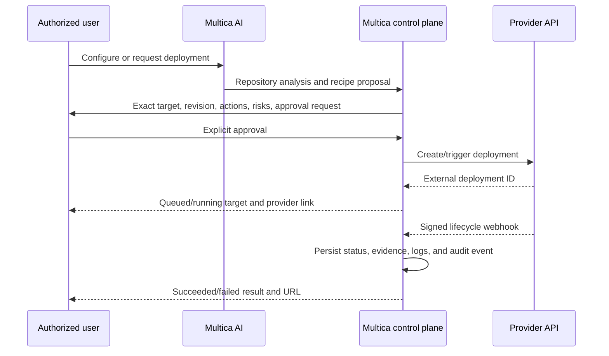

# Cloud Deployment Providers Plan

**Status:** Proposed implementation plan  
**Date:** 2026-09-13  
**Scope:** Let a Multica project create a cloud deployment target or connect an existing one, then run approved, observable deployments. The first provider is Vercel; Railway follows once the provider contract is proven.

**Session record:** [codex-session-01a0969b-6709-7ff1-b2a5-53ff8b8d21f5.md](../codex-session-01a0969b-6709-7ff1-b2a5-53ff8b8d21f5.md) contains the detailed working session for this plan.

## 1. Decisions already made

1. A project can either create a provider project or connect one that already exists.
2. The feature must work for both Multica Cloud and self-hosted Multica.
3. No production deployment, rollback, secret mutation, provider project creation, database creation, or domain change may run without explicit user approval.

The default safe route is preview deployment. Production remains a separate, named approval even when the user previously approved the broader deployment configuration.

## 2. Product outcome

An authorized workspace admin can:

1. Connect a cloud provider account.
2. Select an existing provider project/service or create a new project.
3. Attach it to a Multica project with a repository, branch/ref, environment, root directory, and optional health URL.
4. Ask AI to inspect the repository and propose a deployment recipe.
5. Review a concrete deployment plan: provider target, source revision, environment, missing configuration names, risks, and expected cost/provider actions.
6. Explicitly approve a preview or production deploy.
7. See the provider deployment ID, URL, current status, build/runtime log summary, evidence, and rollback eligibility in Multica.

AI may recommend configuration but must never receive provider access tokens, webhook secrets, or secret environment-variable values.

## 3. Deliberate first-release boundary

The first release is **Vercel only** and supports:

- Existing Vercel project connection.
- New Vercel project creation after a dedicated confirmation.
- Repository-backed preview and production deployment.
- Signed provider status callbacks plus bounded reconciliation polling.
- Read-only provider discovery, target configuration, deployment trigger, status/log links, and rollback when the provider declares it safe.

It does not automatically create databases, purchase/connect domains, edit DNS, or infer and write secret environment-variable values. Those are separate, destructive or account-impacting capabilities and require their own accepted product decision and confirmation UX.

Remix is not a deployment provider. It is a repository/framework recipe that may target Vercel, Railway, Heroku, or another runtime. It must not appear as a peer connection type.

## 4. Current implementation and gap

Multica already has useful deployment control-plane pieces:

| Need | Existing implementation | Consequence |
| --- | --- | --- |
| Deploy policy | `projectorchestration.validateLifecycle` allows deploy nodes only at `delivery` or `closed_loop` autonomy | Preserve this lifecycle gate. |
| Production risk gate | `NodeDeploy` is high risk and can require production approval | Keep the policy; UI approval is not a bypass. |
| Deployment audit record | `autonomous_project_deployment` stores environment, provider, external ref, status, policy snapshot, evidence, and timestamps | Extend the record instead of introducing a second deployment history. |
| Execution entry point | `workflowruntime.executeDeploymentNode` creates a record then calls `DeploymentAdapter.Deploy` | Refactor the adapter contract rather than add a parallel deployment engine. |
| Generic integration | `WebhookDeploymentAdapter` posts a signed bearer-authenticated request and expects an immediate terminal result | Retain it as a custom/self-host escape hatch, but do not use it as the provider implementation model. |
| Existing secret pattern | Self-host VCS connections validate a token and encrypt secrets server-side | Reuse the security properties, not the VCS table or its self-host-only availability switch. |

The important gap is asynchronous state. `DeploymentAdapter.Deploy` currently has a two-minute HTTP timeout and accepts only `succeeded` or `failed`; Vercel, Railway, Render, and Heroku deployment lifecycles can remain queued/building/deploying longer than that. A direct provider integration must return an external operation ID immediately and complete later through webhook or reconciliation.

## 5. Architecture



### 5.1 Data ownership

- A **deployment connection** belongs to a workspace and represents one provider account/team scope. It holds encrypted provider authorization material and no repository-specific deployment choice.
- A **deployment target** belongs to a Multica project and references one connection. It stores provider project/service ID, environment, branch/ref policy, root directory, public URL/health URL, and non-secret configuration metadata.
- `autonomous_project_deployment` remains the immutable attempt history. It gains target identity and provider operation correlation; evidence records provider payloads only after allow-listing safe fields.
- Secrets remain server-side. Cloud uses a managed KMS/envelope-encryption implementation; self-host uses an operator-configured master key. A deployment target never returns the secret after creation.

Do not overload `vcs_connection`: its token grants source-control access, its UI is intentionally self-host-only, and its lifecycle/security scope differs from cloud deployment access.

### 5.2 Provider contract

Use one small internal interface, implemented by each provider:

```go
type DeploymentProvider interface {
    ValidateConnection(ctx context.Context, auth ProviderAuth) (Account, error)
    DiscoverTargets(ctx context.Context, auth ProviderAuth) ([]RemoteTarget, error)
    CreateTarget(ctx context.Context, request CreateTargetRequest) (RemoteTarget, error)
    Trigger(ctx context.Context, request TriggerRequest) (Operation, error)
    GetOperation(ctx context.Context, request GetOperationRequest) (Operation, error)
    Rollback(ctx context.Context, request RollbackRequest) (Operation, error)
}
```

`Trigger` and `Rollback` return a provider operation/external deployment ID and an initial non-terminal status. A durable worker plus signed webhook ingestion advances Multica's attempt state. The existing generic webhook adapter remains a separate implementation of this contract for operators with their own deployment system.

No generic "provider configuration" JSON blob is introduced. Each first-class provider gets typed, validated request data; the shared target stores only common fields plus a narrowly versioned provider configuration payload when unavoidable.

### 5.3 State model

```text
draft -> approval_required -> approved -> trigger_queued -> provider_queued
provider_queued -> building -> deploying -> succeeded
provider_queued/building/deploying -> failed | cancelled
succeeded -> rollback_approval_required -> rollback_queued -> rolled_back | rollback_failed
```

- User rejection leaves the request `rejected`; no provider call occurs.
- Every trigger carries an idempotency key bound to `(target, source revision, environment, approval ID)`.
- Webhooks are verified before persistence, deduplicated by provider event ID, and linked by external deployment ID; unmatched events are retained only as redacted diagnostics.
- Polling is a recovery path, not the primary event stream. It uses exponential backoff and stops at a terminal state or a provider-specific deadline.

## 6. Vercel P0

Vercel supports repository/Git-based deploys, deploy hooks, REST deployment creation, deployment events/logs, and signed account webhooks. The repository-backed route is the initial implementation: Multica triggers the selected target/ref rather than uploading working-tree files or taking over provider build infrastructure. See [Vercel deployment methods](https://vercel.com/docs/deployments/overview) and [Vercel webhooks](https://vercel.com/docs/webhooks).

### 6.1 Vercel user flow

1. Workspace admin selects **Connect Vercel**.
2. Cloud: authorize through provider OAuth. Self-host: OAuth or an admin-entered scoped token, encrypted immediately after validation.
3. Multica discovers accessible teams and projects.
4. Admin either selects a project or asks to create one. Project creation displays organization, project name, linked repository, framework/root-directory proposal, and provider-side effects before confirmation.
5. AI analyses the selected repository and produces a recipe: framework detection, build compatibility, branch/ref, preview vs production, required configuration *names*, and risks.
6. Admin saves the target. This saves configuration only; it does not deploy.
7. A deployment request displays source SHA, target, environment, provider action, and approval scope. Preview or production is approved separately.
8. Multica triggers the deployment, stores Vercel's external ID/URL, accepts signed lifecycle events, and exposes a safe log link/summary.

### 6.2 Vercel constraints

- A Vercel project must already be associated with the selected repository/ref for the repository-triggered path.
- Multica must distinguish a generated preview URL from a production promotion; a successful preview is not a production authorization.
- Provider webhook secret verification and project/team scope checks are mandatory. A callback is never trusted merely because it names an expected project.
- Stateful, long-running, websocket-heavy, or arbitrary container workloads must be flagged as unsuitable for Vercel rather than silently forced through a frontend recipe.

## 7. Provider roadmap

| Priority | Provider | Reason | Minimum capability before shipping |
| --- | --- | --- |
| P0 | Vercel | Best first route for Git-based frontend/Next.js deployments; documented API and webhook surface | Connect/create target, trigger, status callback, evidence, production approval |
| P1 | Railway | General service/container target; public GraphQL API documents deploy, rollback, and logs | Typed GraphQL client, target discovery, operation polling, rollback, logs |
| P2 | Render | Simple deploy hook plus REST API and webhook support | Secret hook handling, status ingestion, reconnect/revoke |
| P2 | Heroku | App build/release lifecycle and signed app webhooks | App/pipeline target model, release correlation, HMAC validation |
| Recipe | Remix | Framework/runtime choice, not account integration | Repository detection and compatible target recommendations |

Railway's public API explicitly covers deployment, rollback, and log operations; Render has deploy hooks and a REST API; Heroku app webhooks report build and release changes. These facts guide ordering, but each connector must be verified against the provider's current API at implementation time. [Railway deployment API](https://docs.railway.com/integrations/api/manage-deployments), [Render deploy hooks](https://render.com/docs/deploy-hooks), [Heroku app webhooks](https://devcenter.heroku.com/articles/app-webhooks)

## 8. Authorization and safety rules

| Action | Required authority | Required confirmation |
| --- | --- | --- |
| Connect/reconnect provider | Workspace admin | Provider authorization/token entry and explicit save |
| Create provider project | Workspace admin | Exact organization, project, repository, and cost-impact confirmation |
| Save non-secret target config | Workspace admin | Normal save confirmation |
| Preview deployment | Workspace admin or delegated deploy role | Source revision + target/environment approval |
| Production deployment | Workspace admin | Dedicated production approval; workflow policy must also permit it |
| Secret environment value mutation | Workspace admin | Dedicated confirmation naming the provider/environment; AI never sees value |
| Domain/DNS/database provisioning | Workspace admin | Separate future capability and confirmation; out of P0 |
| Rollback | Workspace admin | Dedicated confirmation naming the release being restored |
| Disconnect/revoke | Workspace admin | Destructive confirmation; retain redacted audit history |

Agent text, a workflow plan, or a previous preview approval is never proof of approval for a production deploy.

## 9. Delivery phases

### Phase A — contract and persistence

1. Write an ADR for provider connections, secret custody, approval boundaries, and asynchronous operation ownership.
2. Add workspace deployment-connection and project deployment-target persistence, with no foreign keys or cascading actions.
3. Add concurrent indexes in their own single-statement migrations.
4. Extend deployment attempt records with target/provider correlation and a safe evidence schema.
5. Add audit events and admin-only API authorization.

**Exit gate:** migrations, authorization matrix, encryption/revocation tests, and idempotency tests pass.

### Phase B — asynchronous deployment engine

1. Replace terminal-only adapter execution with durable trigger and reconcile jobs.
2. Add provider operation state normalization, polling limits, webhook event deduplication, and correlation.
3. Preserve the existing custom webhook adapter as an operator-controlled provider implementation.
4. Ensure project workflow nodes remain blocked/pending appropriately while an external operation is non-terminal.

**Exit gate:** fake provider tests cover queued, successful, failed, duplicate webhook, delayed webhook, missing webhook, retry, cancellation, and rollback-approval paths.

### Phase C — Vercel connector and UI

1. Implement connection validation, team/project discovery, and connection revocation.
2. Implement existing-target selection and separately-confirmed target creation.
3. Add repository analysis recipe output and explicit deploy approval UI.
4. Implement trigger, signed webhook ingestion, bounded reconciliation, provider URL/log links, and result evidence.
5. Add project deployment history UI shared by web and desktop through `packages/views`; keep app routing/platform details in their existing layers.

**Exit gate:** Vercel sandbox proves preview success, build failure, production rejection without approval, successful approved production deployment, webhook signature rejection, duplicate event idempotency, and disconnect.

### Phase D — observation and rollback

1. Bind successful deployments to the existing observation/incident workflow.
2. Add provider-specific rollback capability detection and confirmation.
3. Keep health checks explicit: a provider build success is not application health evidence.

**Exit gate:** a deliberately failing health check creates visible evidence/incident without autonomous rollback; approved rollback is correlated and audited.

### Phase E — Railway, then Render/Heroku

Implement each connector only after Phase C's contract is stable. A new provider is a connector plus its signed event verification, target UI, API contract tests, and sandbox acceptance—not a new workflow engine.

## 10. Acceptance criteria

- A workspace admin can safely connect or disconnect a provider without exposing stored credentials through API/UI/logs/LLM prompts.
- An existing provider target can be attached to a Multica project.
- A new Vercel project is created only after a dedicated confirmation and is persisted as a target.
- Preview and production paths are visibly distinct; production cannot trigger without both product approval and policy permission.
- An external operation survives backend restart and eventually reaches a terminal state through webhook or bounded reconciliation.
- Replayed/out-of-order callbacks never regress a terminal deployment or create a duplicate history record.
- Provider failure, build failure, and health failure are distinguishable in the UI/evidence.
- Rollback is unavailable unless the provider reports a safe rollback candidate and a workspace admin explicitly approves it.
- The Vercel sandbox flow is run against a real connected account/project before P0 is reported complete.

## 11. Explicitly deferred decisions

1. Whether P0 can create/update provider environment variables after a separately scoped confirmation.
2. Domain, DNS, managed database, volume, and billing-resource provisioning.
3. Which deploy role, if any, may approve previews without workspace-admin status.
4. Cloud KMS vendor/implementation details and supported self-host key-rotation procedure.
5. Automatic rollback policy. The initial release must not auto-rollback; it produces evidence and requests approval.
